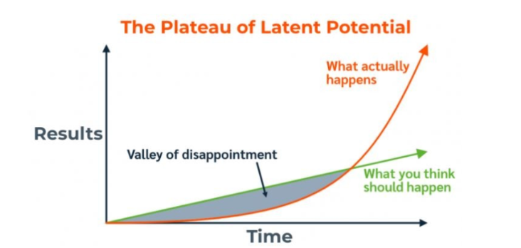

# Atomic Habits - How to build good habits and break bad ones

## Fundamentals - Tiny Changes matter

### Sustained Tiny change Makes a Difference
- We tend to value defining moments but look over daily changes
  - e.g. Steve Jobs is so good at presentation, but most people dont know he work so hard he wake up at 5 in the morning everyday
  - Instead we call it a "talent", neglecting all the tiny effort during his daily effort
- Making a choice 1% better or 1% worse seems insignificant in the moment, but over a life time it becomes the difference of who you are and who you could be.
  - e.g. brush teeth seems useless at the time, but over the years, Your teeth might be your friend or your pain.
- We should concern more about current **Trajectory** than current results.
  - e.g. eat junk food once wont be a problem at all, but if you find yourself keep eating it, you are on a bad trajectory.

### Valley of Disappointment
- Habits appears to make no difference until you cross a critical threshold (Plateau of latent Potential)
- 
- Like melting ice -- nothing seems to happen for a while, then all actions happens at 32 degrees

### Forget about goals, your system will take care of it
- Best way to achieve is to set **Specific, actionable** goals
- Goals are about what you want to achieve (like be fit), systems are the process that lead to that goal (like exercise every day).
- Fantasizing achieving the goal does not make it a reality, real progress come from a usable system.

#### goal-oriented is the problem
- Problem 1: Goal setting suffers from a serious case of survivorship bias:
  - Society amphasizing successful people's (achieved) goals, while ignoring failed people have the same goals.
- Problem 2: Goal only temporarily change things, it treats a symptom but not the cause of it.
  - You decided to clean your messy room, and it is cleaned for now. But without a good habit, it will be messy again in a few days.
  - To improve for good, you need to address and fix at the system level.
- Problem 3: Goal restrict happiness
  - The idea of a goal is like this: "I will be happy only after I have achieved it". You are putting happiness off to chase the carrot.
  - This is why buddist talk about being present: happiness should come from doing, not just from achieving.
  - Also, You either achieve the goal (momentary happiness); or you failed the goal -- Now your brain accociate this action and grief -- which makes doing it even harder.
  - Solution: if you enjoy the process instead of just the result, you can always be happy, which make the habit more likely to survive.
- Problem 4: Goal can't persist over time
  - When your GPA relies on the exam, you are less likely to learn once you achieve the goal -- which might be useful for your GPA but definitely not good for your self-improvement.

### A system of Atomic Habits
- If you failed to change your habits, the problem isn't you, its your system.
- 

## The 1st Law - Make it obvious

## The 2nd Law -  Make it attractive

## The 3rd Law - Make it Easy

## The 4th Law - Make it satisfying

## Advanced Tactics