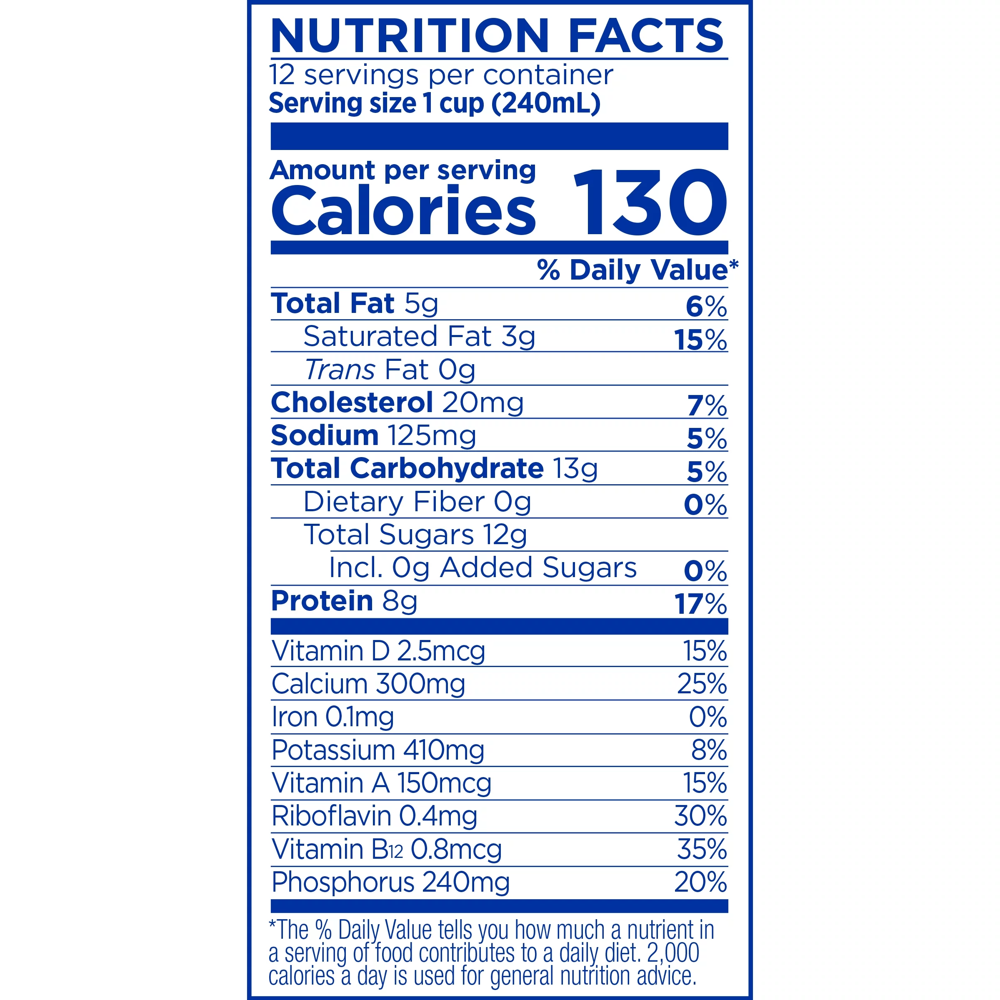
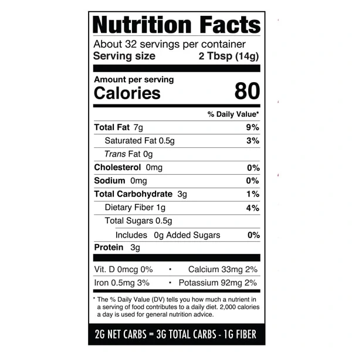

- carb: 20-50g/day
- protein 1.5g/kg of body weight
- Lactaid 2%: 
  - 240ml (1 cup) = 12g carb, 8g protein, 5g fat
- Almond flour: 
  - 14g (2 tbsp) =  2g carb, 3g protein, 7g fat
- oils: just fat
- Pecan:
  - 100g = 14g carb, 9.2g protein, 72g fat
- Strawberry:
  - 152g = 9g carb, 1g protein, 0 fat
  - 2lb = 907g = 54g carb, 6g protein, 0 fat