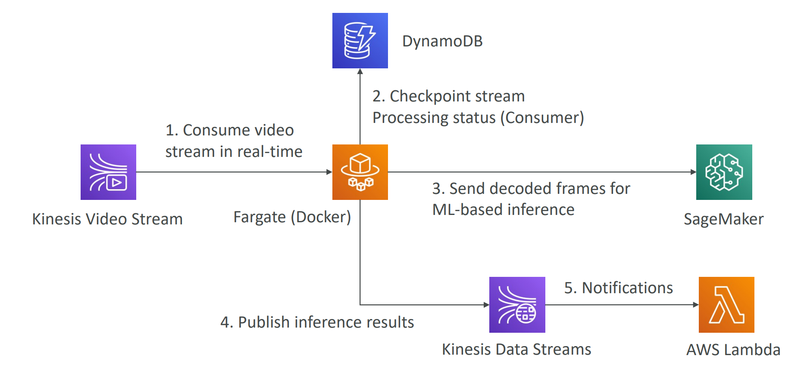

# Kinesis
- Real-time data streaming service
- Think a fireman's hose: input are streams of water, analytics is the valve, then the water blasting out from firehose
- Different types of Kinesis
  - Kinesis Data Streams: low latency streaming ingest at scale (Input)
  - Kinesis Data Analytics: real-time stream analysis using **SQL** (process)
  - Kinesis Data Firehose: load stream into other services like S3, Redshift, ElasticSearch, etc (output)
  - Kinesis Video Streams: streaming video in realtime (special case)

- Kinesis Streams (Real Time): 
  - Data is stored as shards (another name for partition)
  - Data will be kept for 24 hours by default (can go up till 1 year)
  - Data cant be deleted once inserted (immutable)
  - Each record (a shard can have multiple records) can be up to 1MB

- Different Modes (in capacity)
  - Provisioned Mode (planed before use):
    - You chose # of shards, scale manually
    - 1MB/s (or 1k record per second whichever comes first) read, 2MB/s write per shard (same 2k record)
    - pay per shard per hour
  - On-demand Mode:
    - auto scaling (when you don't know your capacity needs)
    - Default at 4MB/s, then Scaled based on throughput peak over 30 days
    - Pay per stream per hour + data I/O per GB

- Limits for Input (Producer) and Output (Consumer)
  - Producer: `ProvisionedThroughputException` when beyond 1MB/s limit
  - Consumer: 2MB/s per shard or 5 API calls per second
  - Data Retention: 24 hours to 1 year

- Kinesis Firehose (Near Real Time)
  - Can read from kinesis streams, also CloudWatch and IoT.
  - Read single record, (can use Lambda to transform) then batch write (which is why near real time)
  - Can write to S3, Redshift, ElasticSearch, etc
  - Failed data can be stored in another S3 bucket

- Fully managed, no administration (auto scaling), pay for data per GB
- can compress if output is S3

- Kinesis Data Analytics / Apache Flink (serverless, for Stream ETL)
  - (Kinesis Data analytics is Apache Flink over AWS)
  - Flink supports Java, scala, python now
  - Flink is just a framework for processing data streams
  - MSAF (managed service for apache flink): You can develop your own Flink application and load it into Kinesis Data Analytics via S3
  - Or you can use Table API to use SQL to process data (which is less powerful than flink)
  - Inputs: For real-time take Streams as input, near real time take Firehose as input
  - input treated as a table, using SQL.
  - Output: S3 as a sink, or Lambda for further processing / storage
  - Use cases:
    - streaming ETL: fast real time
    - metric generation: real time dashboard
    - responsive analytics: real time alerts
    - pay for resources used but not cheap
    - use IAM to manage access source and destination
  - For Machine Learning:
    - `RANDOM_CUT_FOREST` for anomaly detection (find outliers)
    - `HOTSPOTS` for finding hotspots in data

- Kinesis Video Stream
  - Producer: cameras / DeepLens
  - consumers: Rekognition Video, SageMaker, etc
  - Data can be kept for 1 hour to 10 year
  - Use case (Detect bugler) 