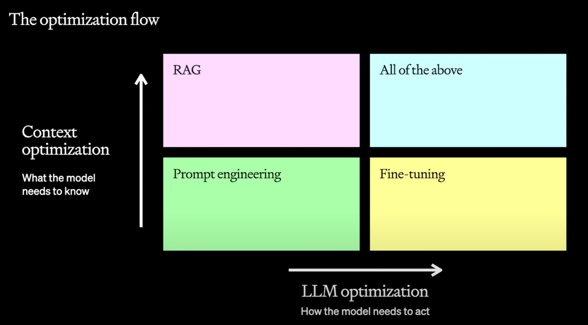

## Reference
- [A Survey for Maximizing LLM Performance](https://youtu.be/ahnGLM-RC1Y?si=SSwdUOLKTxZCgkHk)

## Different Types of Optimization
- 

## Generic Steps for optimizing LLMs
1. First run model directly on prompt to figure out the baseline
2. add few shots of examples and see how the model works
    1. if few shots increase the performance, then we could use RAG to hook it with some Knowlege Base
3. Then maybe the model does not always provide the output in the right format or style, then we fine-tune the model.
4. Now you want the RAG knowlege to be more relevant so you add advanced steps in RAG like HyDE retrieval, fact checks, etc.
5. we could then feed the output generated back to the model to fine-tune the model  from its own output.

## Optimization Strategies
- Make your instrcutions clearer and simpler
- Split complex tasks to simple ones.
- Evals & tests need to be systemetic to avoid later confusion (use some sort of llm ops)
- tell your gpt **approach this task step-by-step, and Take your time to think**

## When to use what solution

### When to use prompt Engineering
- early testing and learning
- provides baseline

### 
