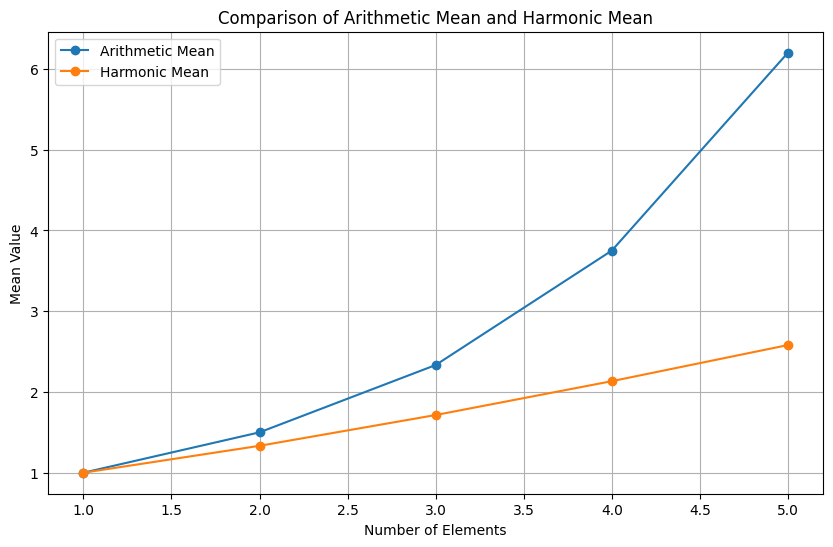

### Comparision
- Harmonic mean smooths out the effect of outliers. heres a demo

```python
import matplotlib.pyplot as plt
import numpy as np
from matplotlib.animation import FuncAnimation

def harmonic_mean(numbers):
    n = len(numbers)
    reciprocal_sum = sum(1 / x for x in numbers if x != 0)
    return n / reciprocal_sum if reciprocal_sum != 0 else 0

# Sample data
data = [1, 2, 4, 8, 16]

# Calculate means
arithmetic_means = [np.mean(data[:i+1]) for i in range(len(data))]
harmonic_means = [harmonic_mean(data[:i+1]) for i in range(len(data))]

# Plot comparison
plt.figure(figsize=(10, 6))
plt.plot(range(1, len(data)+1), arithmetic_means, label='Arithmetic Mean', marker='o')
plt.plot(range(1, len(data)+1), harmonic_means, label='Harmonic Mean', marker='o')
plt.xlabel('Number of Elements')
plt.ylabel('Mean Value')
plt.title('Comparison of Arithmetic Mean and Harmonic Mean')
plt.legend()
plt.grid(True)
plt.show()
```
output: 