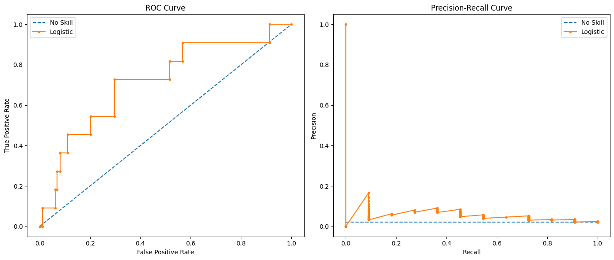

### Problem with ROC Curve
- When data is imbalanced, ROC curve can be misleading.
- Heres a demo
```python
import matplotlib.pyplot as plt
from sklearn.datasets import make_classification
from sklearn.linear_model import LogisticRegression
from sklearn.model_selection import train_test_split
from sklearn.metrics import roc_curve, roc_auc_score, precision_recall_curve, f1_score, auc

# Generate 2 class dataset with imbalance
X, y = make_classification(n_samples=1000, n_classes=2, weights=[0.99, 0.01], random_state=1)

# Split into train/test sets
trainX, testX, trainy, testy = train_test_split(X, y, test_size=0.5, random_state=2)

# Generate a no skill prediction (majority class)
ns_probs = [0 for _ in range(len(testy))]

# Fit a model
model = LogisticRegression(solver='lbfgs')
model.fit(trainX, trainy)

# Predict probabilities
lr_probs = model.predict_proba(testX)
# Keep probabilities for the positive outcome only
lr_probs = lr_probs[:, 1]

# Predict class values
yhat = model.predict(testX)

# Calculate scores
ns_auc = roc_auc_score(testy, ns_probs)
lr_auc = roc_auc_score(testy, lr_probs)

# Calculate ROC curves
ns_fpr, ns_tpr, _ = roc_curve(testy, ns_probs)
lr_fpr, lr_tpr, _ = roc_curve(testy, lr_probs)

# Calculate Precision-Recall curve
lr_precision, lr_recall, _ = precision_recall_curve(testy, lr_probs)
# Calculate scores
lr_f1, lr_pr_auc = f1_score(testy, yhat), auc(lr_recall, lr_precision)

# Print summary scores
print('No Skill: ROC AUC=%.3f' % (ns_auc))
print('Logistic: ROC AUC=%.3f' % (lr_auc))
print('Logistic: f1=%.3f auc=%.3f' % (lr_f1, lr_pr_auc))

# Plot ROC curve
plt.figure(figsize=(14, 6))
plt.subplot(1, 2, 1)
plt.plot(ns_fpr, ns_tpr, linestyle='--', label='No Skill')
plt.plot(lr_fpr, lr_tpr, marker='.', label='Logistic')
# Axis labels
plt.xlabel('False Positive Rate')
plt.ylabel('True Positive Rate')
plt.title('ROC Curve')
plt.legend()

# Plot Precision-Recall curve
plt.subplot(1, 2, 2)
no_skill = len(testy[testy == 1]) / len(testy)
plt.plot([0, 1], [no_skill, no_skill], linestyle='--', label='No Skill')
plt.plot(lr_recall, lr_precision, marker='.', label='Logistic')
# Axis labels
plt.xlabel('Recall')
plt.ylabel('Precision')
plt.title('Precision-Recall Curve')
plt.legend()

# Show the plot
plt.tight_layout()
plt.show()
```
