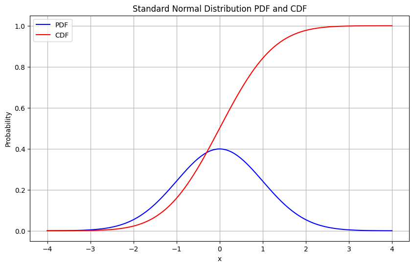
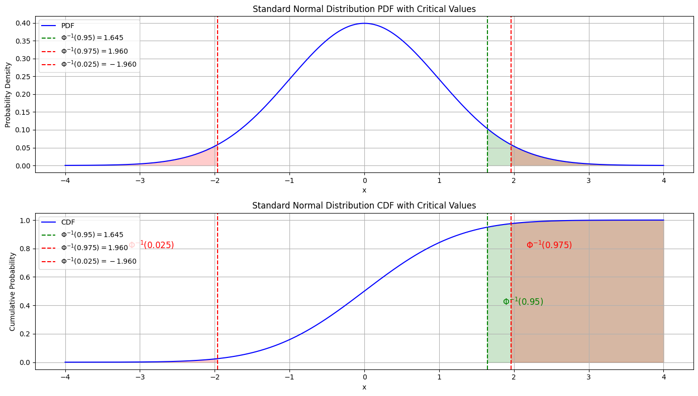
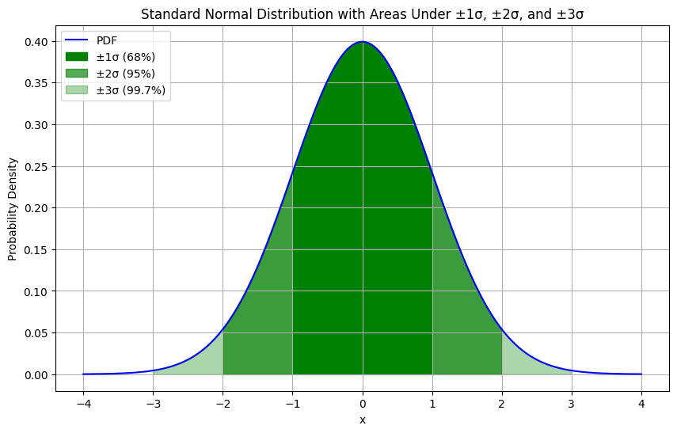

### Intro
- Statistical tests is to prove whether two variables are correlated or not
- You make an assumption (hypothesis) and you use statistical tests to prove it true or false
- There are two possible assumptions regarding two variables:
  - The Null Hypothesis (H0): no relationship
  - The alternative hypothesis (H1): is a relationship


### Normal Distribution
- To understand the p-value, z-test, critical value, etc., you need to understand the normal distribution (which is the assumption of the data in order to use these tests)
- PDF (Probability Density Function) of a standard normal distribution:
  $$
  f(x) = \frac{1}{\sqrt{2\pi}}e^{-\frac{x^2}{2}}
  $$
- CDF (Cumulative Distribution Function) of a standard normal distribution:
  $$
  F(x) = \int_{-\infty}^{x} f(x)dx
  $$
- Plot of these two:
  ```python
  import numpy as np
  import matplotlib.pyplot as plt
  import scipy.stats as stats

  # Define the standard normal distribution
  x = np.linspace(-4, 4, 1000)
  pdf = stats.norm.pdf(x)
  cdf = stats.norm.cdf(x)

  # Plot the PDF
  plt.figure(figsize=(10, 6))
  plt.plot(x, pdf, label='PDF', color='blue')

  # Plot the CDF
  plt.plot(x, cdf, label='CDF', color='red')

  # Add labels and legend
  plt.title('Standard Normal Distribution PDF and CDF')
  plt.xlabel('x')
  plt.ylabel('Probability')
  plt.legend(loc='best')

  # Show the plot
  plt.grid(True)
  plt.show()
  ```
  - 

### Calculate Critical Value From Confidence
- Lets say we want to be 95% confident that the null hypothesis is true
- Lets not worry about what this means yet, but we can calculate the CDF of the SND for single tail and double tail
- Lets say we represent CDF as $\Phi$ then the inverse of $\Phi$ is $\Phi^{-1}$
- Looking back at the normal distribution, what we want is:
  - For single tail: find the x where CDF is 0.95 we can represent this as $\Phi^{-1}(0.95)$
  - For double tail: find the x where CDF is 0.975, and the x where CDF is 0.025. we can represent this as $\Phi^{-1}(0.975)$ and $\Phi^{-1}(0.025)$
- This seems a bit hard to understand so lets plot them:
  ```python
  import numpy as np
  import matplotlib.pyplot as plt
  import scipy.stats as stats

  # Define the standard normal distribution
  x = np.linspace(-4, 4, 1000)
  pdf = stats.norm.pdf(x)
  cdf = stats.norm.cdf(x)

  # Calculate critical values
  alpha_single_tail = 0.95
  z_single_tail = stats.norm.ppf(alpha_single_tail)

  alpha_double_tail = 0.975
  z_double_tail_right = stats.norm.ppf(alpha_double_tail)
  z_double_tail_left = stats.norm.ppf(1 - alpha_double_tail)

  # Plot the PDF and CDF
  plt.figure(figsize=(14, 8))

  # PDF
  plt.subplot(2, 1, 1)
  plt.plot(x, pdf, label='PDF', color='blue')
  plt.axvline(z_single_tail, color='green', linestyle='--', label='$\Phi^{-1}(0.95) = 1.645$')
  plt.axvline(z_double_tail_right, color='red', linestyle='--', label='$\Phi^{-1}(0.975) = 1.960$')
  plt.axvline(z_double_tail_left, color='red', linestyle='--', label='$\Phi^{-1}(0.025) = -1.960$')
  plt.fill_between(x, 0, pdf, where=(x >= z_single_tail), color='green', alpha=0.2)
  plt.fill_between(x, 0, pdf, where=(x >= z_double_tail_right), color='red', alpha=0.2)
  plt.fill_between(x, 0, pdf, where=(x <= z_double_tail_left), color='red', alpha=0.2)
  plt.title('Standard Normal Distribution PDF with Critical Values')
  plt.xlabel('x')
  plt.ylabel('Probability Density')
  plt.legend(loc='upper left')
  plt.grid(True)

  # CDF
  plt.subplot(2, 1, 2)
  plt.plot(x, cdf, label='CDF', color='blue')
  plt.axvline(z_single_tail, color='green', linestyle='--', label='$\Phi^{-1}(0.95) = 1.645$')
  plt.axvline(z_double_tail_right, color='red', linestyle='--', label='$\Phi^{-1}(0.975) = 1.960$')
  plt.axvline(z_double_tail_left, color='red', linestyle='--', label='$\Phi^{-1}(0.025) = -1.960$')
  plt.fill_between(x, 0, cdf, where=(x >= z_single_tail), color='green', alpha=0.2)
  plt.fill_between(x, 0, cdf, where=(x >= z_double_tail_right), color='red', alpha=0.2)
  plt.fill_between(x, 0, cdf, where=(x <= z_double_tail_left), color='red', alpha=0.2)
  plt.title('Standard Normal Distribution CDF with Critical Values')
  plt.xlabel('x')
  plt.ylabel('Cumulative Probability')
  plt.legend(loc='upper left')
  plt.grid(True)

  # Add text annotations
  plt.text(z_single_tail + 0.2, 0.4, '$\Phi^{-1}(0.95)$', color='green', fontsize=12)
  plt.text(z_double_tail_right + 0.2, 0.8, '$\Phi^{-1}(0.975)$', color='red', fontsize=12)
  plt.text(z_double_tail_left - 1.2, 0.8, '$\Phi^{-1}(0.025)$', color='red', fontsize=12)

  plt.tight_layout()
  plt.show()
  ```


### Understand standard deviation
- Based on the AUC of the normal distribution we can easily calculate that 68% of the AUC is within 1 standard deviation, 95% is within 2 standard deviation, and 99.7% is within 3 standard deviation.
- This can be shown by accumulating the CDF of the SND between -1 and 1, -2 and 2, -3 and 3
  ```python
  import numpy as np
  import matplotlib.pyplot as plt

  # Define the standard normal distribution
  x = np.linspace(-4, 4, 1000)
  pdf = stats.norm.pdf(x)

  # Plot the PDF
  plt.figure(figsize=(10, 6))
  plt.plot(x, pdf, label='PDF', color='blue')

  # Highlight the areas within 1, 2, and 3 standard deviations
  x_fill_1 = np.linspace(-1, 1, 1000)
  pdf_fill_1 = stats.norm.pdf(x_fill_1)
  plt.fill_between(x_fill_1, pdf_fill_1, color='green', alpha=0.99, label='±1σ (68%)')

  x_fill_2 = np.linspace(-2, 2, 1000)
  pdf_fill_2 = stats.norm.pdf(x_fill_2)
  plt.fill_between(x_fill_2, pdf_fill_2, color='green', alpha=0.66, label='±2σ (95%)')

  x_fill_3 = np.linspace(-3, 3, 1000)
  pdf_fill_3 = stats.norm.pdf(x_fill_3)
  plt.fill_between(x_fill_3, pdf_fill_3, color='green', alpha=0.33, label='±3σ (99.7%)')

  # Add labels and legend
  plt.title('Standard Normal Distribution with Areas Under ±1σ, ±2σ, and ±3σ')
  plt.xlabel('x')
  plt.ylabel('Probability Density')
  plt.legend(loc='upper left')
  plt.grid(True)

  # Show the plot
  plt.show()
  ```
  - 
  ```python
  import scipy.stats as stats
  # Define the standard normal distribution
  mean = 0
  std_dev = 1
  # Calculate the CDF values for ±1, ±2, and ±3 standard deviations
  cdf_1_std = stats.norm.cdf(1, mean, std_dev) - stats.norm.cdf(-1, mean, std_dev)
  cdf_2_std = stats.norm.cdf(2, mean, std_dev) - stats.norm.cdf(-2, mean, std_dev)
  cdf_3_std = stats.norm.cdf(3, mean, std_dev) - stats.norm.cdf(-3, mean, std_dev)
  # Print the results
  print(f"Area within ±1 standard deviation: {cdf_1_std * 100:.2f}%")
  print(f"Area within ±2 standard deviations: {cdf_2_std * 100:.2f}%")
  print(f"Area within ±3 standard deviations: {cdf_3_std * 100:.2f}%")
  # Result:
  # Area within ±1 standard deviation: 68.27%
  # Area within ±2 standard deviations: 95.45%
  # Area within ±3 standard deviations: 99.73%
  ```


### Understand how z-test works
- (Key takeaway: standard deviation is a translator between distribution and frequency)
- Now that we know what is a critical value (critical area), even though we still don't know what it's used for. Lets use a real example to make sense of it.
- Lets say we got a coin but we are not sure if its a fair coin or not (for fair gaming, we need it to be balanced for head and tail)
- The only thing we can do is experiment (trial) and use those results to maybe prove that the coin is fair or not
- Lets flip the coin for 100 times! We got 60 heads and 40 tails. Is this a fair coin?
- We know that in a perfect world we should get 50 heads and 50 tails. But reality have randomness so maybe 60, 40 is still a fair coin.
- But how do we know with **confidence**?
- This is where z-test comes in: we can calculate the z-score z = (x - $\mu$) / $\sigma$
- Here x is the sample mean (sample is our flips) while $\mu$ is the population mean (population is the perfect world where we get 50, 50)
- We also need the standard deviation $\sigma$ of the population (which is $\sqrt{p(1-p)}$ since its a binomial distribution)
- We can easily get the z-score 
  $$
    z = \frac{(80 - 70)}{4.58} \approx 2.18
  $$
- Now we know how to calculate the z-score, but what does it mean?
- We need to look into its equation:
  $$
  z = \frac{(x - \mu)}{\sigma}
  $$
- We have 60 head in reality and 50 head in ideal world, so the top half of the equation is: the trail count difference between reality (the **sample**) and ideal world. And the bottom is obviously the standard deviation of the truth (the ideal world or the **population** in statistics term) if our sample aligns perfectly with the population, z-score should be 0.
- If we look back at the standard deviation 68% rule, we could say that if we flip 100 coins, there is a 68% chance that we get:
  $$
  head\_count \in [50-\sigma, 50+\sigma] = [45.4, 54.6]
  $$
- standard deviation **translates** normal distribution's x value to the frequency offset from the mean
- And conversely, we can say that if we get 60 heads, it means that we are not within the 68% range. (since 60 is outside of [45.4, 54.6])
- So, what is the 95% chance range? (from before we know it should be between 2 $\sigma$)
- Using the exact same method we can get that if the coin is fair, there is a 95% chance that our 100 flip will get head_count between [40.84, 59.16]. Which is a pretty hight confidence level -- thus if we got something out side the range we have the same confidence level that the coin is not fair. 
- In our case, 60 is outside of [40.84, 59.16] so we can say that the coin is not fair with 95% confidence level.
- More formally we can say that the null hypothesis is proven false with 95% confidence level. (here the null hypothesis is that the coin is fair)
go back to [Intro](#Intro).
- Now we understand how to prove a hypothesis from frequencies' perspective, how do we go back to the PDF? In other words, what is a score in probability's realm that shows 60 head is outside of 95% confidence level? (remember how standard deviation translates x to frequency? this is where we need it to convert back)
- So we know 60 head gives a more than 95% confidence level. But is there a way to get the exact number?
- The answer is yes, and that number is called the p-value. (which is closely related to the z-score)

## TODO: How do we understand p-value and z-score?

### Critical Value
- the value where you either reject or accept the null hypothesis
- 