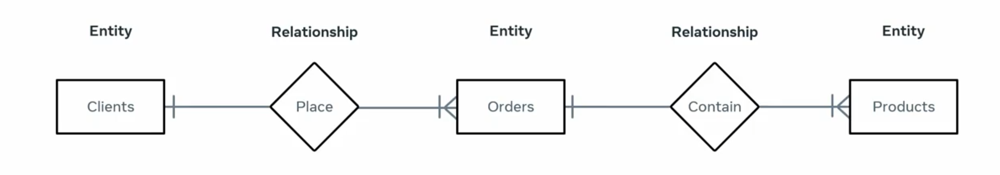
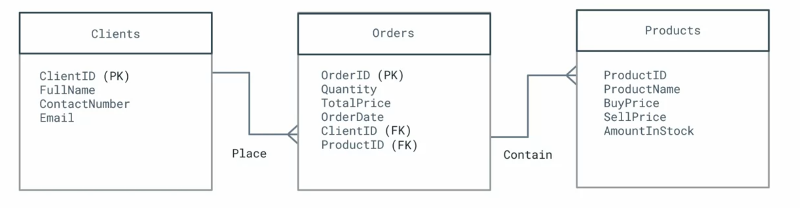
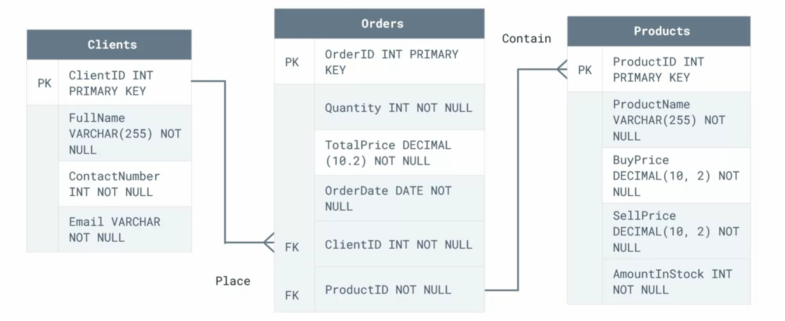
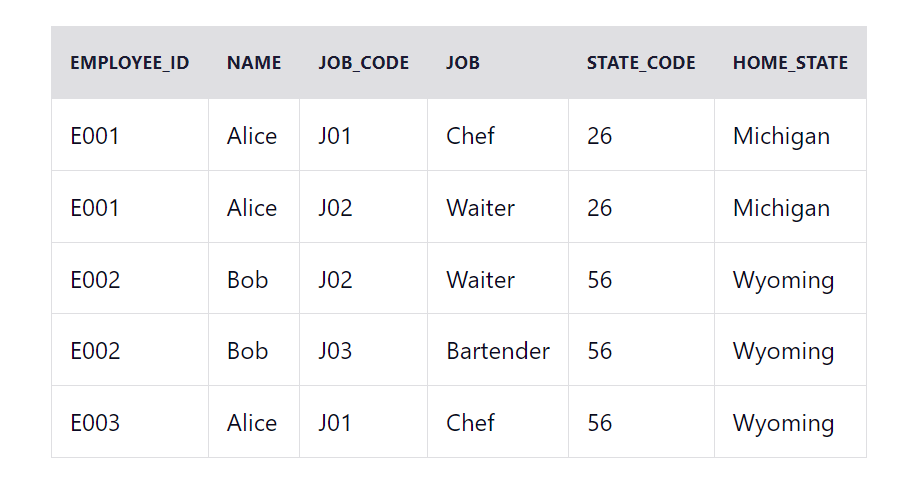
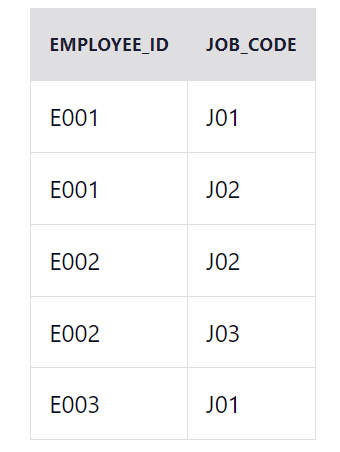
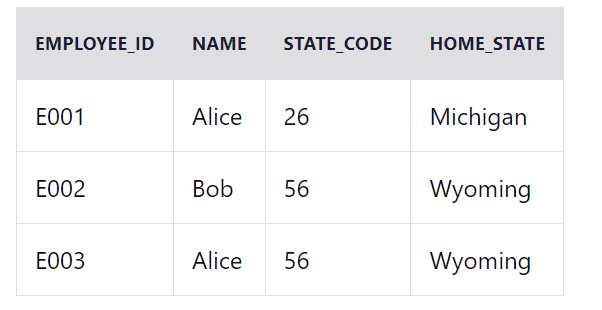
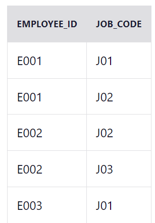
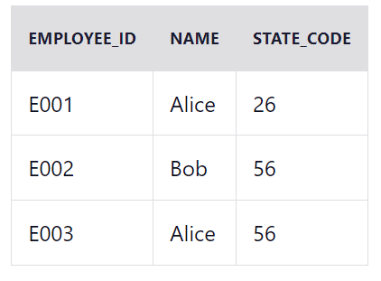
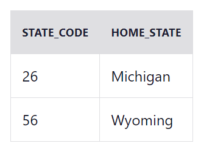

### Data modeling
- Show how your data is structured
- 

### Three Levels of data modeling
- Conceptual data model (high level overview)
  - Focus on Business requirements and rules
  - focus on relationship & entities
  - 
- Logical data model:
  - identify attributes, primary keys, foreign keys
  - 
- Physical data model:
  - Data types, constraints, attributes
  - 

### Types of Data Models
- entity-relationship model
- hierarchical model
- object-oriented model
- dimensional model (dimensions and facts tables)

### Data Anomalies
- When Add/Del/Mod data, something else need to happen besides the intended operation
- example: cant add until extra info, cant delete until extra delete, cant update without updating other

### How to avoid Anomalies
- 1NF: Each column should have a single value

## 1NF
- purpose: eliminate repeating groups.
- for a table to be in 1NF, it must be:
  - Atomicity: each cell must contain a single value
  - Consistency: same col, same type
  - Uniqueness: each row must be unique (use primary key)
- example: 
- notice the example: 
  - no composite attributes, and each row is unique with composite key (EMPLOYEE_ID + JOB_CODE), thus 1NF
  - have partial dependencies (job does not ONLY depend on EMPLOYEE_ID, also depend on JOB_CODE), thus not 2NF

## 2NF
- purpose: eliminate partial dependencies (redundancy)
- is 1NF
- Non-key attributes depend and only depend on current primary key
- Example:
  - 
  - 
  - 
- Notice in the example: 
  - all non-key attributes solely depend on the primary key, thus 2NF
  - However there is inter-non-key dependencies like state code and home_state, thus not 3NF

## 3NF
- purpose: eliminate transitive partial dependencies
- is 2NF, and no non-key attributes inter-depend on each other
- Example:
  - 
  - 
  - 
  - 

## BCNF
- Boyce-Codd Normal Form
