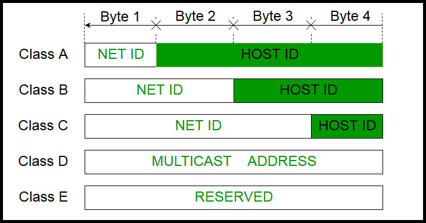

- range of TCP/IP classes
  - 32 bits (8 bit as 0-255)
  - 

- private IP addresses
  - IP not routable on public internet
    - class A: 10.x.x.x
    - class B: 172.16.x.x
    - class C: 192.168.x.x
  - No one can have public IP within these ranges
  - Your private network IP can only be within this range

- OSI 7 layers
  1. physical: 
     - cable, fiber, 
     - hardware for transport data 
     - (just raw bits)
  2. Data Link: 
     - Switch, Bridge,etc 
     - start to have concept of a node
     - start to have error detection and correction, 
     - cuts the raw bits into frames 
     - ?? whats the diff between frames and packets?
     - have MAC addresses for physical devices
     - MAC is for local network only (LAN)
     - Switches use MAC to forward data to the right device
     - start to use MAC to increase efficiency and reduce collisions
     - Switch save a table port to MAC for reroute packets
  3. Network: Packets, IP
     - IP address (internet protocol) is for large networks, can map data between networks (MAC only local)
     - IP is hierarchical better routing efficiency. 
     - MAC cant do sub-netting.
     - IP can change.
  4. Transport layer
     - reassemble pieces back to original message.
     - handles connections for TCP
     - manages flow control
     - detect errors

  5. Session
     - manage session states like auth stuff

  6. Presentation
  7. Application: end user layer

### Transport vs IP data piece name diff
- a piece of data is called segment for TCP
- called a packet for IP layer

### TCP vs UDP (User Datagram Protocol)
  | tcp                   | udp                               |
  | --------------------- | --------------------------------- |
  | connection oriented   | datagram oriented (no-connection) |
  | reliable              | not guaranteed delivery           |
  | more error check      | basic errorcheck                  |
  | arrive-in-order       | not ordered                       |
  | retransmission        | just lost                         |
  | longer header, slower | shorter header, faster            |

### TCP reliability
- checksum, use re-transmission, ACK signal, and timers to recover lost segments
- multiplexing: many sockets share one cable
- full-duplex: r-w same time
- stream orientation: 

### Flow control
- control amount of packets en-route, sliding windows

### Common ports
- FTP: 20, HTTP: 80, HTTPS: 443 etc

### Congestion Control
- traffic jam, limit transfer rate
| stop-and-wait           | sliding window                 |
| ----------------------- | ------------------------------ |
| send 1 and wait for ACK | send n and and refill when ACK |
| low efficiency          | high efficiency                |

### Round Trip Time (RTT)
- time between send out req to got response

### Leaky Bucket and Token Bucket
- Both implemented on sender side!
- LB: like a buffer
- TB: buffer but also manages flow rate using fixed tokens count

